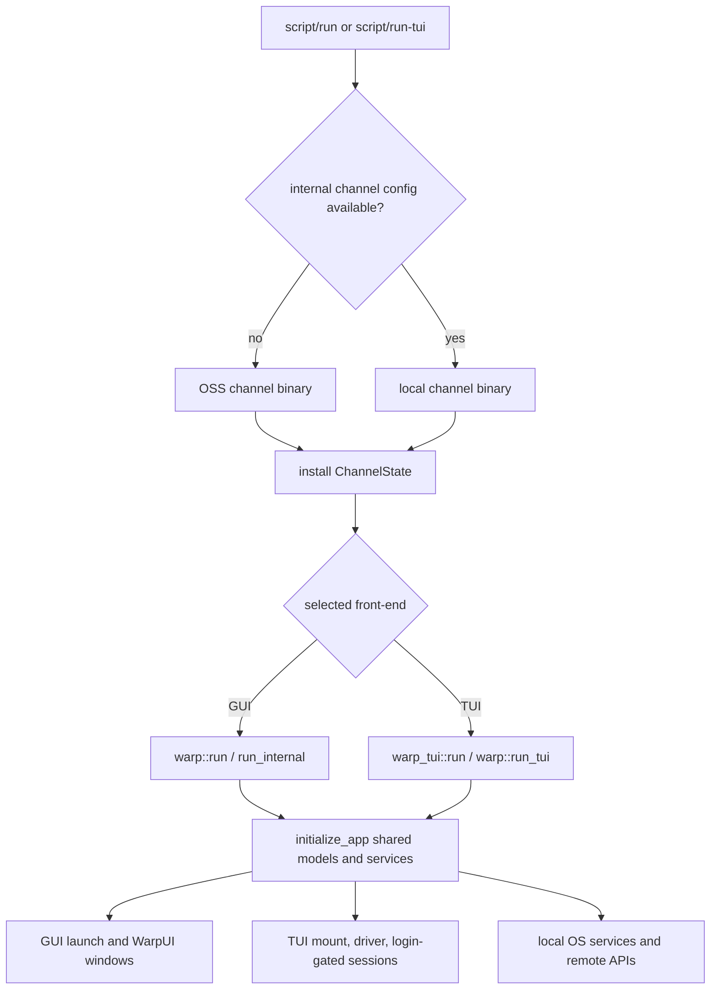

# Warp repository map

> Navigation aid only. Current executable code, selected build configuration, and
> applicable tests are authoritative. See the [analysis index](00-index.md) for
> scope, exclusions, revision, working-tree context, and maintenance policy.

## What this repository is

Warp is a cross-platform, Rust-based agentic development environment built around
a terminal. This repository owns the open-source client: terminal/shell process
management, local state, agent and editor experiences, cloud-client integrations,
and two native front-ends over a shared application/model core.

It does **not** contain the Warp or Oz service implementations. Client types and
requests can establish what crosses those boundaries, but cannot establish
server-side model routing, authorization enforcement, retention, billing, or
production topology.

## System at a glance

| Concern | Practical answer |
| --- | --- |
| Default runnable targets | OSS GUI `warp-oss` (`app/src/bin/oss.rs`) and OSS console TUI `warp-tui-oss` (`crates/warp_tui/src/bin/oss.rs`); both are the `default-run` targets in their package manifests. |
| Shared composition root | `warp::run` and `initialize_app` in `app/src/lib.rs`; the TUI deliberately reuses this bootstrap through `warp::run_tui`. |
| UI split | GUI uses WarpUI pixel/GPU elements (`crates/warpui`, `crates/warpui_core`); TUI uses the cell-grid `TuiElement` runtime plus `crates/warp_tui`. |
| Core product areas | `app/src/terminal`, `app/src/workspace`, `app/src/ai`, `app/src/code`, `app/src/auth`, `app/src/drive`, and `app/src/settings`. |
| Runtime selection | Channel-specific binaries install a process-global `warp_core::channel::ChannelState`; scripts select internal `local` when `warp-channel-config` exists, otherwise OSS. |
| Central local state | Settings/preferences initialized from `app/src/settings/init.rs`; SQLite persistence lives in `crates/persistence`; secure-storage implementation is selected by platform and launch mode in `initialize_app`. |
| External boundaries | Warp/Oz HTTP and WebSocket services, cloud-object synchronization, authentication providers, model providers, MCP servers, shell/PTY processes, OS keychains, and update/crash/telemetry services when configured. |
| Test approach | Rust unit tests live beside modules in separate `*_tests.rs`/`mod_test.rs` files; GUI end-to-end coverage is in `crates/integration`; TUI behavior uses render-to-lines tests and direct terminal verification. |

## Runtime and architecture model

The package manifests select OSS entry points for ordinary open-source builds.
Each channel binary first creates `ChannelState`, fixing app identity, service
configuration, and baseline feature sets, then calls its shared front-end runner.
`script/run` and `script/run-tui` may instead choose internal `local` binaries if
the separately installed channel-config generator is available.

For the GUI, `warp::run` performs platform initialization, initializes flags,
parses CLI/worker modes, and otherwise enters `run_internal`. That path builds the
WarpUI application, registers platform-dependent services and preferences, calls
`initialize_app` for shared models (settings, auth, API clients, appearance, and
product services), then dispatches to the normal GUI `launch` path.

The TUI is not a thin wrapper around an independent core. `warp_tui::session::run`
parses TUI-only arguments and calls `warp::run_tui`; the same shared bootstrap runs
with `LaunchMode::Tui`, after which `app/src/tui/mod.rs` mounts the TUI callback.
`crates/warp_tui/src/session.rs::init` creates the cell-grid window and driver,
wires session/orchestration models, and defers the first terminal session until
login succeeds.

Target differences are material. macOS GUI execution goes through app bundling
and signing; Linux/Windows run the selected Cargo binary directly. GUI rendering
has platform backends and window integration, while the TUI remains a console
process. Compile-time features still select capabilities such as `gui`, `tui`,
`local_tty`, crash reporting, and integration-test substitutes; runtime
`FeatureFlag` checks layer channel and preference/experiment behavior on top.

## High-value navigation and change map

| Area or intended change | Inspect first | Why | Important caveat |
| --- | --- | --- | --- |
| Startup, CLI modes, or global service composition | `app/src/lib.rs`: `run`, `run_internal`, `initialize_app`, `launch`; `app/Cargo.toml` | This is the shared composition root and mode dispatcher. | Worker, GUI, CLI, remote-daemon, and TUI launch modes intentionally initialize different subsets. |
| Build/channel behavior or server endpoints | `script/run`, `script/run-tui`, channel binaries under `app/src/bin` and `crates/warp_tui/src/bin`, `crates/warp_core/src/channel` | Establishes which binary/config/feature baseline is active. | Internal config is generated outside the OSS checkout; release channels reject server URL overrides. |
| GUI UI or window behavior | `app/src/workspace`, `crates/warpui`, `crates/warpui_core`, then `crates/integration` | Workspace is the principal GUI surface; WarpUI owns entity/view and GPU/window machinery. | Do not assume TUI parity; use GUI integration tests and a real display. |
| TUI rendering, input, or sessions | `crates/warp_tui/src/session.rs`, `root_view.rs`, relevant view; `crates/warpui_core/src/elements/tui` | Shows mount/login/session lifecycle and cell-grid primitives. | It shares app models but not GUI elements; validate in a real terminal and with render-to-lines tests. |
| Terminal/shell lifecycle | `app/src/terminal`, `crates/warp_terminal`, `crates/command`; search `TerminalModel` and PTY spawners | Separates product terminal state from emulator/process primitives. | Treat `TerminalModel::lock` call paths as a deadlock boundary; platform/remote PTYs differ. |
| Agent behavior and model requests | `app/src/ai`, `crates/ai`, `crates/warp_server_client`; request/protocol types before UI | Connects conversation state and tools to local or remote inference clients. | Provider/server transformations beyond emitted requests are absent; distinguish user and automated/Oz runs. |
| Authentication or secure credentials | `app/src/auth`, `AuthState` creation in `initialize_app`, `crates/warp_server_auth`, `warpui_extras::secure_storage` registrations | Finds session state, API auth, and platform storage selection. | A remote daemon disables interactive secure storage; server-side authorization is not proven here. |
| Settings or feature rollout | `app/src/settings/init.rs`, relevant settings model, `crates/warp_core/src/features.rs`, channel binary | Traces definition, load, and actual behavioral check. | A defined setting/flag is not proof it is active in a given channel; GUI/TUI exposure may differ. |
| Local/cloud persistence and sync | `crates/persistence`, `app/src/cloud_object`, `crates/cloud_object_client`, `crates/cloud_object_persistence` | Separates SQLite ownership from network synchronization and product models. | Conflict resolution or retention performed by remote services cannot be inferred from client schemas. |
| Remote sessions and helper processes | `app/src/remote_server`, `crates/remote_server`, worker dispatch in `app/src/lib.rs` | Shows daemon/proxy/ripgrep subprocess boundaries. | Proxy and daemon have deliberately different initialization and credential behavior. |

## Core concepts

**Entity/model context.** WarpUI's `App` owns singleton models and views; handles
are accessed transiently through `AppContext`, `ModelContext`, or `ViewContext`.
This shapes composition, subscriptions, and UI updates across both front-ends,
even though only the GUI uses pixel/GPU elements.

**Channel versus feature selection.** A channel binary establishes identity and
baked service configuration in `ChannelState`, then adds channel feature sets.
Runtime flags and preferences can further alter behavior, while Cargo features
remain responsible for code that cannot exist on every target.

**Launch modes.** The same `app` crate serves GUI, command-line agent operations,
worker subprocesses, remote-server modes, tests, and the TUI. Before changing
startup, establish the `LaunchMode` and which initialization/launch branch it
actually reaches rather than treating `warp::run` as one homogeneous path.

**Two front-ends, shared application services.** GUI `Element` trees and TUI
`TuiElement` cell grids are separate presentation systems. Auth, settings,
appearance, actions, and many agent/terminal models are shared through the same
bootstrap, so a model change may be cross-surface even when a view change is not.

## External boundaries and known unknowns

- `ChannelConfig` supplies Warp and Oz endpoints; GraphQL/HTTP/WebSocket and
  cloud-object clients define the client-visible contracts. The corresponding
  service implementations and operational deployment are not in this repository.
- Authentication code proves credential acquisition/storage and attachment to
  client calls, not server authorization, entitlements, billing, or account-data
  retention. Platform keychain behavior also requires target-specific validation.
- Agent code can prove selected local tools, request construction, streaming event
  handling, and client state transitions. Remote model choice, prompt transforms,
  safety policy, and provider retention remain unknown unless exposed explicitly
  by a client response or separate service documentation.
- Shells, PTYs, MCP servers, language servers, Git hosts, and OS services are trust
  boundaries controlled partly by user environment. Fixtures and mocks establish
  client expectations, not universal behavior of those external processes.
- Internal channel configuration is selected by an external generator. OSS
  binaries hand-construct production endpoint configuration, but this checkout
  alone cannot verify the generated values or release deployment selection.

For repeated changes in one area, add a focused subsystem analysis rather than
expanding this map. Authentication/secure storage, agent request/tool execution,
and terminal/PTY lifecycle are the strongest candidates because each crosses
local state, platform selection, and external trust boundaries.
