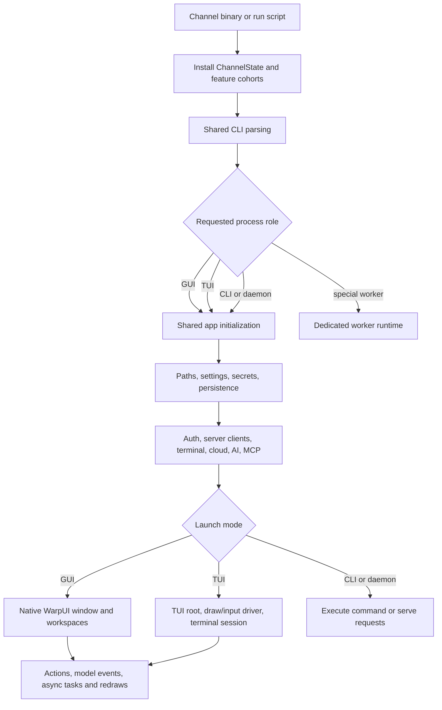

# Runtime flow

## Main commands and entrypoints

| Command | Runtime selected |
|---|---|
| `./script/bootstrap` | Installs platform build prerequisites, then resolves shared agent skills unless explicitly skipped. |
| `./script/run` or `cargo run` | Desktop application. The default Cargo binary is `warp-oss`; `script/run` uses the internal local channel when its generated config tool is available. |
| `WITH_LOCAL_SERVER=1 ./script/run` | Local desktop build with application and real-time server URLs aimed at a developer server. |
| `./script/run-tui` | Channel-specific `warp_tui` binary and terminal-native UI. |
| `warp agent ...` / `oz ...` | Headless or optionally GUI-backed agent command, routed through the common CLI parser. |
| `cargo nextest run ...` | Unit and integration test processes; integration uses a special channel and isolated state. |

The channel wrappers in `app/src/bin/` and `crates/warp_tui/src/bin/` establish `ChannelState` first. They then delegate to `warp::run` or `warp_tui::run`, keeping product initialization shared.

## Configuration loading

Configuration comes from several layers with different responsibilities:

1. **Build/channel configuration** fixes the app identifier and default URLs for Warp, real-time GraphQL, session sharing, Oz, updates, telemetry, and crash reporting. OSS builds carry public production endpoints but omit telemetry, crash reporting, and autoupdate configuration.
2. **Command-line/environment overrides** are parsed by `warp_cli`. Server URL overrides are honored only for channels that explicitly allow them, preventing shipped release builds from being redirected.
3. **User settings** are loaded into typed settings groups. Public settings can use a user-visible TOML file; private preferences stay in the native/private backend.
4. **Persistent and secret state** is loaded from a launch-mode-specific SQLite database and secure-storage namespace. The TUI deliberately uses separate settings, database, MCP config, and secrets from the GUI.
5. **Repository-scoped inputs** such as `.warp/workflows`, project rules, skills, and MCP configuration are watched or discovered after core services exist.

## Shared service initialization

`app/src/lib.rs` performs early platform, feature, tracing, logging, crash, and resource-limit setup before starting the WarpUI event loop. It then initializes the application graph through `AppContext`.

The important dependency order is:

- paths, secure storage, settings, and preferences;
- authentication state and authenticated server clients;
- telemetry/privacy and launch-mode-specific persistence;
- terminal, appearance, input, workspace, cloud-object, AI, MCP, code, and repository models;
- subscriptions, background synchronization/watch tasks, and finally the selected UI or command.

Some failures intentionally degrade a capability rather than aborting the whole product. For example, persistence initialization can fail without preventing a new terminal from opening, but prior sessions will not be restored.

## Once running

### Desktop GUI

WarpUI owns the native event loop and window collection. The root view creates or restores workspaces, whose tabs and panes host terminal sessions and other surfaces.

Input becomes actions or terminal bytes. PTY output updates the terminal model and produces redraws, structured blocks, history, and persistence updates. Background models maintain authentication, cloud objects, agents, indexing, updates, settings, notifications, and external integrations.

### Headless TUI

The TUI reuses shared initialization but does not start a native GUI window or the GUI-only loopback HTTP server. Its mount callback creates a TUI window, starts a nonblocking terminal draw/input driver, and waits for login before creating the first local terminal session.

An optional `--resume` token restores a server conversation into that session. On normal exit, the TUI can print a continuation command containing the conversation token.

### CLI and workers

One-shot commands enter a headless `LaunchMode` and initialize only the capabilities needed by that mode. Dedicated worker invocations can run a terminal server, plugin host, crash/minidump service, ripgrep subprocess, remote proxy, or remote daemon without constructing the normal desktop surface.

## Mode differences

| Concern | Local/dev | Release/OSS | Integration tests | TUI |
|---|---|---|---|---|
| Server overrides | Allowed on internal development channels. | Release channels ignore redirection overrides; OSS uses compiled production endpoints. | Network endpoints are black-holed unless tests install controlled behavior. | Follows its channel wrapper and shared channel rules. |
| Feature set | Adds debug/dogfood/preview/local cohorts as appropriate. | Uses the channel's released cohort; OSS debug builds add debug flags. | Deterministic integration channel. | Uses channel cohorts but a distinct presentation surface. |
| Persistence | Channel/profile-isolated app database. | Channel-isolated app database. | Temporary/fixture-driven state. | Separate TUI database. |
| Settings and secrets | GUI namespace; optional debug data profile. | GUI namespace. | No-op secure storage and isolated preferences. | Local-only settings and a separate secure-storage service. |
| UI | Native GUI. | Native GUI. | Native GUI driven by the integration framework. | Cell-grid terminal UI. |

## Runtime flow diagram

