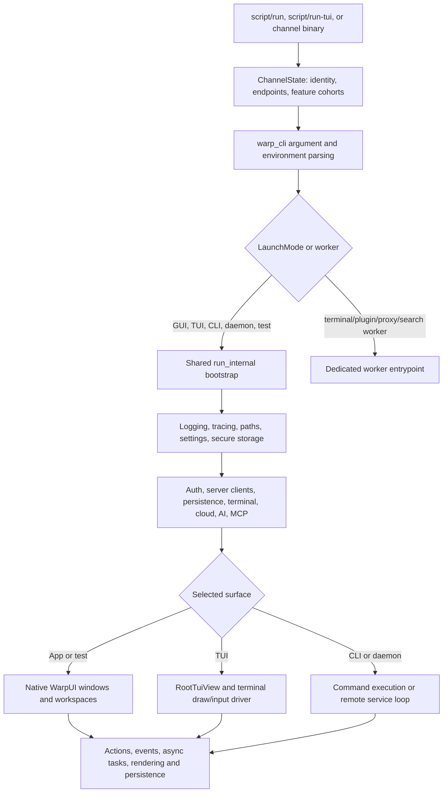
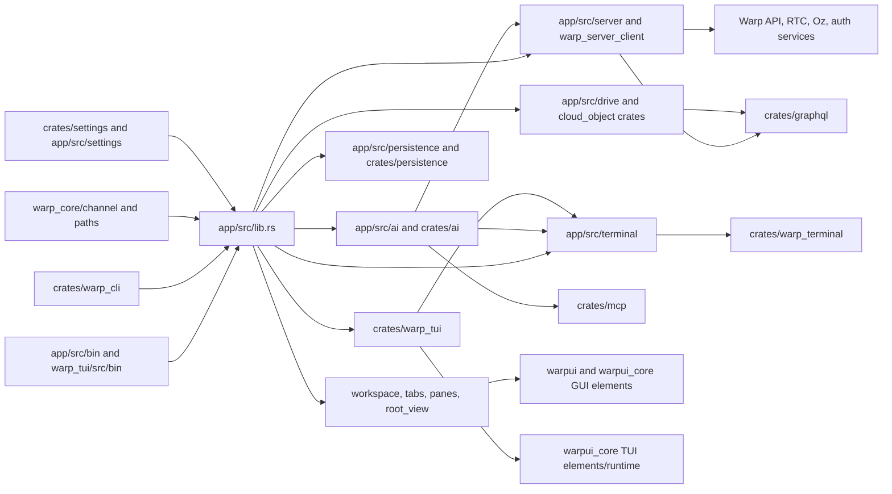
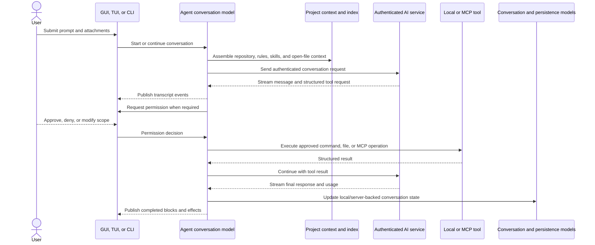
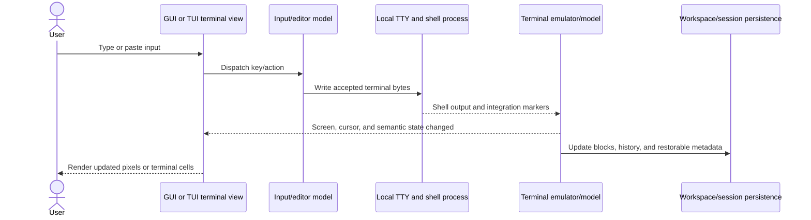

# Architecture diagrams

These diagrams intentionally stop at subsystem boundaries. Many internal models and views are omitted so that startup and behavior remain legible.

## 1. Runtime flow

## 2. Module and file interaction

## 3. Agent conversation with a tool call

## 4. Terminal input and rendering

