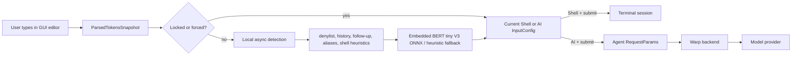
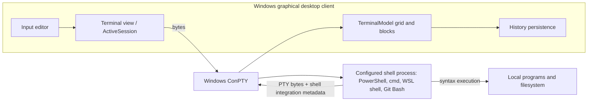
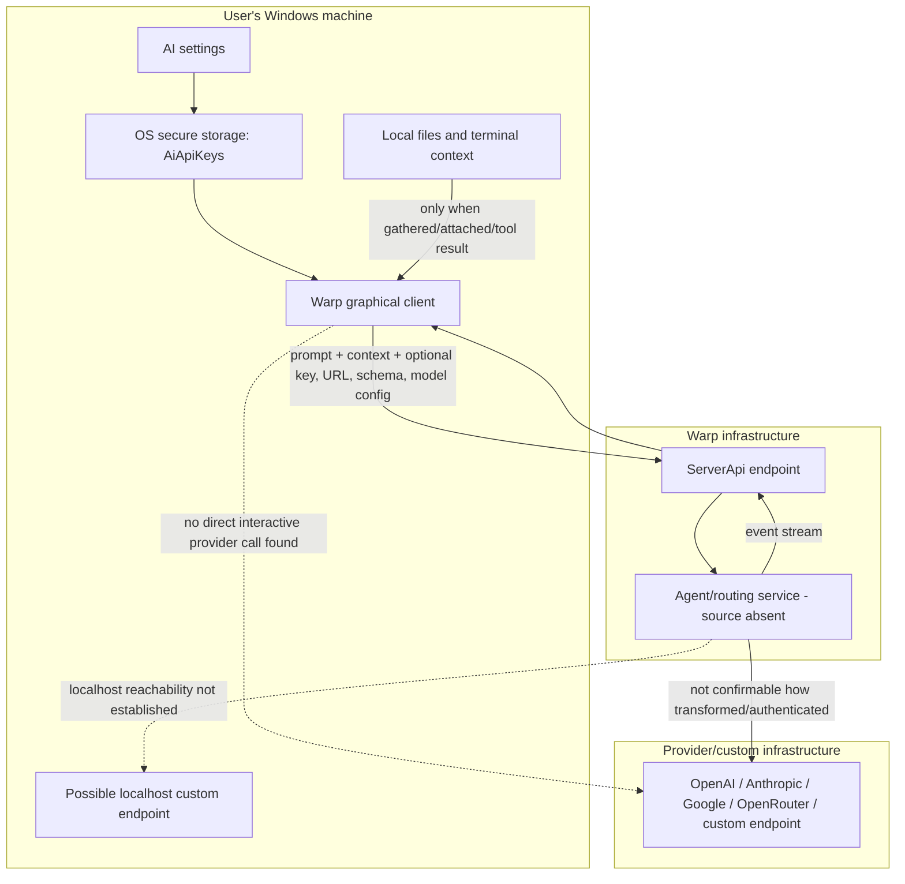

# Architecture diagrams

## 1. Input interpretation and routing



## 2. Windows shell execution



## 3. AI request and tool execution

```mermaid
sequenceDiagram
  actor User
  participant Desktop as Windows desktop client
  participant Warp as Warp backend / agent service
  participant Provider as Model provider
  participant Shell as Local shell via ConPTY
  participant FS as Local filesystem

  User->>Desktop: Submit input routed as AI
  Desktop->>Desktop: Select/create conversation; gather local context
  Desktop->>Warp: multi-agent Request (model, context, tools, optional BYOK)
  Warp->>Provider: Provider request (implementation unavailable)
  Provider-->>Warp: Model stream/tool proposal
  Warp-->>Desktop: ResponseEvent stream / client action
  Desktop-->>User: Render proposal and request permission if needed
  User->>Desktop: Allow / deny / take control
  alt shell tool allowed
    Desktop->>Shell: Submit agent command
    Shell->>FS: Read/write/execute as command requires
    Shell-->>Desktop: Output, exit status, block metadata
    Desktop->>Warp: Structured action result
    Warp->>Provider: Continue conversation (unavailable implementation)
  else denied
    Desktop->>Warp: Denied/cancelled action result
  end
  Warp-->>Desktop: Continued streamed response
```

## 4. BYOK/custom endpoint trust boundary



Dashed edges explicitly mean “not established by this repository,” not guaranteed network paths.
